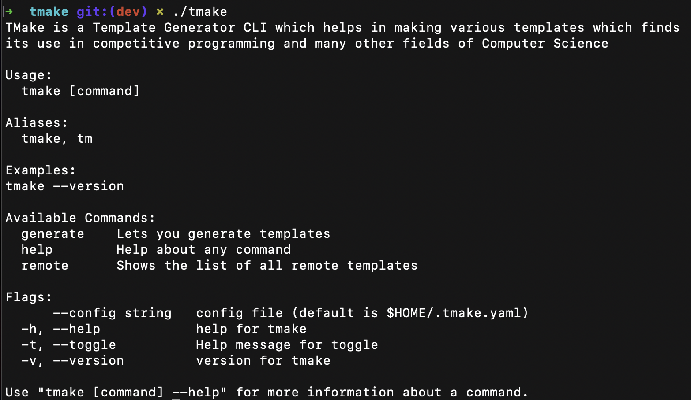

# TMake - Template Generator CLI

`TMake` is still work under progress. The aim of this project is to make a functional 
and easy to use CLI for making templates with a single command. What templates you ask? 
Well, competitive programmers need quick file generator because many of us do get to know 
about a competition when we're just minutes away from commencing.

To tackle this seemingly minute yet huge issue, I came up with an idea of making a CLI to help
competitive coders to get ready in a single command.

## Getting started

As of now, Tmake's binary is only available through GitHub releases. We'll soon be entering Homebrew,
MacPorts, Chocolatey, WinGet, scoop and downloadable MSI.

## Docs

To be updated!

## Contributing

Kindly go through our [Contributing Guidelines](https://github.com/EmperorYP7/tmake/blob/master/.github/CONTRIBUTING.md)
for instructions to build TMake from source and contribute to the wellbeing of the project.

This project follows a [Code of Conduct](https://github.com/EmperorYP7/tmake/blob/master/.github/CODE-OF-CONDUCT.md)
